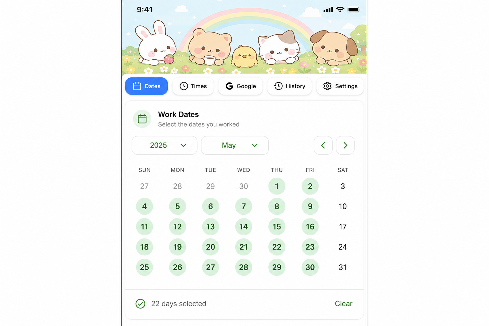
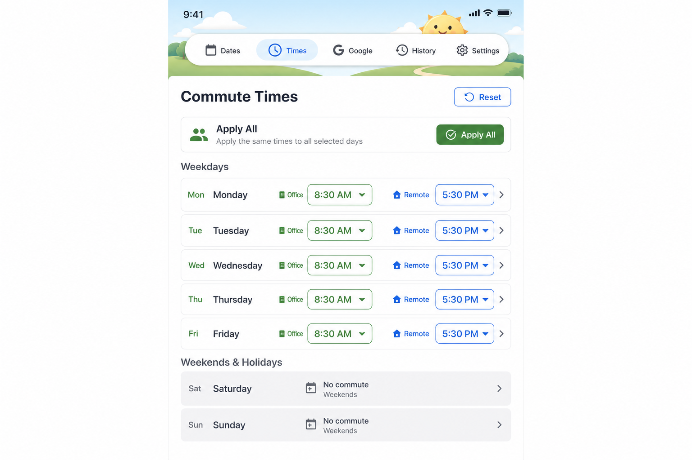
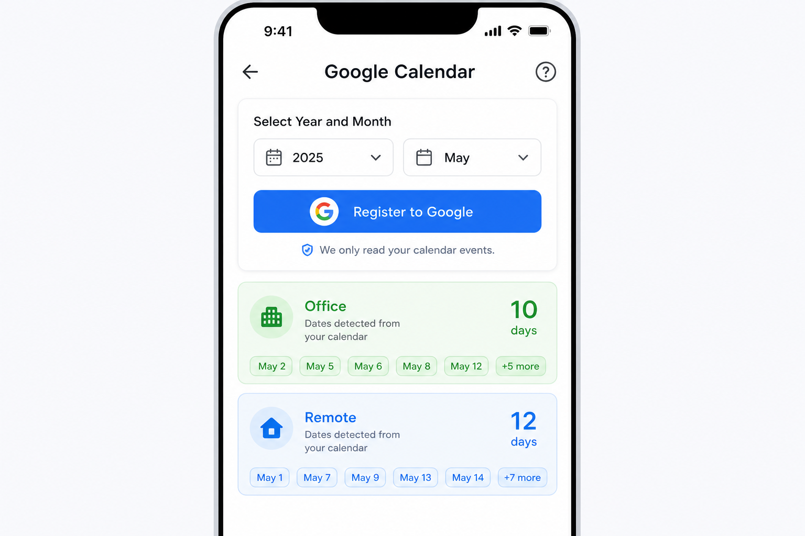
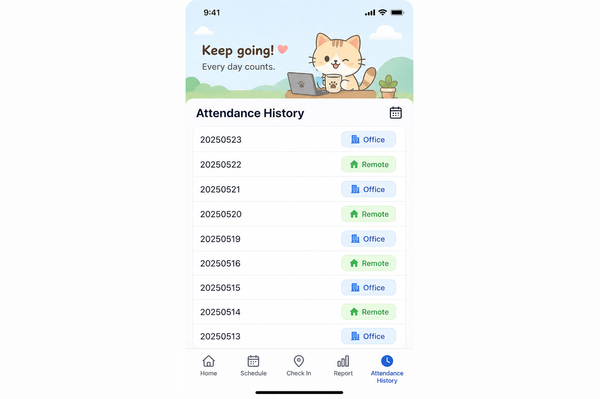
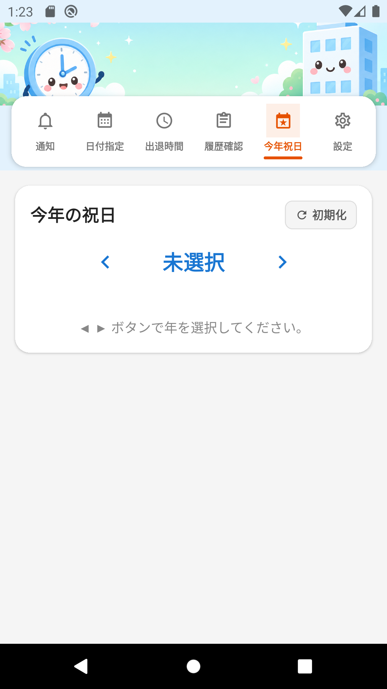

# Commute Manager (Work Attendance App)

**Program Name:** Commute Manager (`출퇴근 관리` / `出退勤管理`)  
**Version:** 1.0.0  
**Package ID:** `com.googlecalenderapp`

A React Native mobile application for managing office attendance dates, commute times, Google Calendar integration, attendance history, and settings (multi-language, CSV export, email).

---

## Development Environment & Packages

### Required Environment

| Item | Version |
|------|---------|
| Node.js | 18 or higher (20.x recommended) |
| npm | 8+ |
| JDK | 17 (for Android APK build) |
| Android SDK | API 34 (Android 14) |
| Android Build Tools | 34.x |

### Core Framework

| Package | Version | Purpose |
|---------|---------|---------|
| expo | ~51.0.28 | React Native framework & build tools |
| react | 18.2.0 | UI library |
| react-native | 0.74.5 | Mobile runtime |
| typescript | ~5.3.3 | Type-safe development |

### Navigation & UI

| Package | Version | Purpose |
|---------|---------|---------|
| @react-navigation/native | ^6.1.18 | App navigation |
| @react-navigation/material-top-tabs | ^6.6.14 | Top tab menu |
| react-native-tab-view | ^3.5.2 | Tab view component |
| react-native-pager-view | 6.3.0 | Swipeable tabs |
| react-native-safe-area-context | 4.10.5 | Safe area layout |
| react-native-screens | 3.31.1 | Native screen containers |
| @react-native-picker/picker | 2.7.5 | Year/month/day pickers |

### Data & Storage

| Package | Version | Purpose |
|---------|---------|---------|
| @react-native-async-storage/async-storage | 1.23.1 | Local data persistence |

### Google Calendar Integration

| Package | Version | Purpose |
|---------|---------|---------|
| expo-auth-session | ~5.5.2 | OAuth authentication |
| expo-web-browser | ~13.0.3 | OAuth browser flow |
| expo-crypto | ~13.0.2 | Cryptographic utilities |

### Settings Features (Export & Email)

| Package | Version | Purpose |
|---------|---------|---------|
| expo-file-system | ~17.0.1 | CSV file creation |
| expo-sharing | ~12.0.1 | Share / save CSV files |
| expo-mail-composer | ~13.0.1 | Native email composer |
| expo-document-picker | ~12.0.2 | File attachment selection |

### Install & Run

```bash
nodebrew use v20.18.0   # or any Node 18+
npm install
npm run android:emu     # Android emulator
npm start               # Expo dev server
```

### Build APK

```bash
npm run build:apk
# Output: dist/출퇴근관리-v1.0.0.apk
```

A pre-built APK is also committed in the repository:

```
dist/출퇴근관리-v1.0.0.apk
```

---

## Supported Android Versions

| | |
|---|---|
| **Minimum** | Android 6.0 (API 23, Marshmallow) |
| **Target** | Android 14 (API 34) |
| **Compile SDK** | API 34 |

The app runs on **Android 6.0 and above**. It is optimized for Android 14.

---

## Features

The app provides five top-tab menus. The default display language is **Japanese** (configurable to Korean or English in Settings).

---

### 1. Set Work Dates (出勤日指定)

Select office attendance days on a monthly calendar.

**How to use:**
- Choose year and month
- Tap a date to mark it as an office day (green background)
- Double-tap quickly on a marked date to unmark it
- Selected dates are listed at the bottom



---

### 2. Commute Times (出退勤時間入力)

Enter clock-in and clock-out times for office and remote days.

**How to use:**
- Select year, month, and day
- Enter clock-in / clock-out time using **HH hours MM minutes** pickers
- Tap **Apply All** for clock-in or clock-out to bulk-apply to eligible weekdays in the month
- Manually edit each office day and remote day individually (same time picker UI)
- Tap **Save** to store data and preview the saved list

**Bulk apply rules (updated):**
- Applies to both **office and remote** days in the selected month
- **Excludes Saturdays and Sundays**
- **Excludes Japanese national holidays** (祝日), including:
  - Fixed holidays (New Year's Day, National Foundation Day, Emperor's Birthday, etc.)
  - Happy Monday holidays (Marine Day, Respect for the Aged Day, Sports Day)
  - Vernal/Autumnal Equinox days
  - Substitute holidays (振替休日) and Citizens' holidays (国民の休日)
- The screen shows the number of eligible days (e.g. `Excludes Sat/Sun & JP holidays · N days`)



---

### 3. Google Calendar (Googleカレンダー連携)

Register office days to Google Calendar.

**How to use:**
- Select year and month
- Tap **Register to Google** to sign in and create calendar events
- Office days and remote days are displayed at the bottom

**Setup:** Set `EXPO_PUBLIC_GOOGLE_CLIENT_ID` in `.env` (see `.env.example`).



---

### 4. Attendance History (出勤履歴確認)

View monthly attendance records.

**How to use:**
- Select year and month
- Tap **View** to display the list
- Office days: `YYYYMMDD:Office`
- Other days: `YYYYMMDD:Remote`



---

### 5. Settings (設定)

Language, attendance report export, and email.

#### 5-1. Display Language
Choose **Japanese**, **Korean**, or **English**. All screens update immediately.

#### 5-2. Attendance Report (CSV Export)
- Select export month
- Set lunch break duration (excluded from work hours)
- Tap **Export** to generate and share a CSV file

**CSV format example:**
```
2026年 06月 出勤履歴
01日: 出勤時刻:09:00、退勤時刻:18:00、稼働時間:08時間00分
...
[総勤務時間:160時間00分]
```

#### 5-3. Send Email
- Enter recipient, subject, and body
- Attach files (including exported CSV)
- Tap **Send Email** to open the device mail app



---

## Feature Updates

| Item | Description |
|------|-------------|
| Default language | **Japanese** on first launch (changeable in Settings) |
| Bulk time entry | Excludes **weekends** and **Japanese holidays** from bulk apply |
| Time input UI | Per-day editing uses **HH:MM picker** instead of free-text fields |
| Settings tab | Display language, attendance CSV export, email with attachments |
| APK download | Pre-built APK available at `dist/출퇴근관리-v1.0.0.apk` in the repository |
| Holiday logic | `src/utils/japaneseHolidays.ts` calculates Japan public holidays per year |

---

## Project Structure

```
googleCalenderApp/
├── App.tsx                    # Main app & tab navigation
├── src/
│   ├── screens/               # Feature screens
│   ├── components/            # Shared UI components
│   ├── context/               # Data & language context
│   ├── i18n/                  # Translations (ja/ko/en)
│   ├── utils/                 # Date, storage, CSV, Japanese holiday utilities
│   └── services/              # Google Calendar API
├── docs/images/
│   ├── en/                    # English screen captures
│   ├── ja/                    # Japanese screen captures
│   └── ko/                    # Korean screen captures
├── assets/                    # App icon & splash
├── android/                   # Native Android project
└── dist/                      # Built APK output
```

---

## License

Private project.
