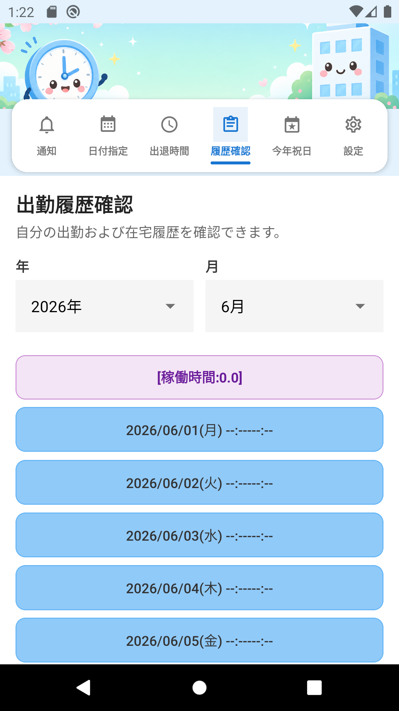

# 出退勤管理アプリ

**プログラム名:** 出退勤管理（Commute Manager）  
**バージョン:** 1.0.0  
**パッケージID:** `com.googlecalenderapp`

出勤日指定、出退勤時刻入力、Googleカレンダー連携、出勤履歴確認、設定（多言語・勤怠表CSV出力・メール送信）機能を提供する React Native モバイルアプリです。

---

## 開発環境および関連パッケージ

### 必要な開発環境

| 項目 | バージョン |
|------|-----------|
| Node.js | 18 以上（20.x 推奨） |
| npm | 8 以上 |
| JDK | 17（Android APK ビルド用） |
| Android SDK | API 34（Android 14） |
| Android Build Tools | 34.x |

### コアフレームワーク

| パッケージ | バージョン | 用途 |
|-----------|-----------|------|
| expo | ~51.0.28 | React Native フレームワーク・ビルドツール |
| react | 18.2.0 | UI ライブラリ |
| react-native | 0.74.5 | モバイルランタイム |
| typescript | ~5.3.3 | 型安全な開発 |

### ナビゲーション・UI

| パッケージ | バージョン | 用途 |
|-----------|-----------|------|
| @react-navigation/native | ^6.1.18 | アプリナビゲーション |
| @react-navigation/material-top-tabs | ^6.6.14 | 上部タブメニュー |
| react-native-tab-view | ^3.5.2 | タブビューコンポーネント |
| react-native-pager-view | 6.3.0 | スワイプ可能タブ |
| react-native-safe-area-context | 4.10.5 | セーフエリアレイアウト |
| react-native-screens | 3.31.1 | ネイティブスクリーンコンテナ |
| @react-native-picker/picker | 2.7.5 | 年月日ピッカー |

### データ・ストレージ

| パッケージ | バージョン | 用途 |
|-----------|-----------|------|
| @react-native-async-storage/async-storage | 1.23.1 | ローカルデータ永続化 |

### Googleカレンダー連携

| パッケージ | バージョン | 用途 |
|-----------|-----------|------|
| expo-auth-session | ~5.5.2 | OAuth 認証 |
| expo-web-browser | ~13.0.3 | OAuth ブラウザフロー |
| expo-crypto | ~13.0.2 | 暗号化ユーティリティ |

### 設定機能（出力・メール）

| パッケージ | バージョン | 用途 |
|-----------|-----------|------|
| expo-file-system | ~17.0.1 | CSV ファイル作成 |
| expo-sharing | ~12.0.1 | CSV ファイル共有・保存 |
| expo-mail-composer | ~13.0.1 | ネイティブメール作成 |
| expo-document-picker | ~12.0.2 | ファイル添付選択 |

### インストール・実行

```bash
nodebrew use v20.18.0   # または Node 18 以上
npm install
npm run android:emu     # Android エミュレーター
npm start               # Expo 開発サーバー
```

### APK ビルド

```bash
npm run build:apk
# 出力: dist/出退勤管理-v1.0.0.apk
```

リポジトリにはビルド済み APK も含まれています:

```
dist/出退勤管理-v1.0.0.apk
```

---

## 対応 Android バージョン

| | |
|---|---|
| **最小バージョン** | Android 6.0（API 23、Marshmallow） |
| **ターゲットバージョン** | Android 14（API 34） |
| **コンパイル SDK** | API 34 |

本アプリは **Android 6.0 以降** で動作します。Android 14 向けに最適化されています。

---

## 機能別説明

アプリは **上部のかわいいバナー** と、バナー画像上の **6 つのリンクボタンメニュー** で構成されます。メニュー名は **通知 · 日付指定 · 出退時間 · 履歴確認 · 今年祝日 · 設定** です。デフォルト表示言語は **日本語** です（設定で中国語・韓国語・英語に変更可能）。

**他言語マニュアル:** [한국어](README_KO.md) · [中文](README_ZH.md) · [English](README.md)

---

### 1. 通知（出勤日メモ）

出勤日に入力した特記事項メモを日付別カードで表示します。


---

### 2. 出勤日指定

月間カレンダーで出勤日を選択します。

**使い方:**
- **年・月** を出勤履歴確認画面と同じドロップダウンピッカーで選択
- 日付をタップして出勤日を指定（緑色の丸）
- 同じ日付を素早く 2 回タップすると解除
- **日本の祝日** はカレンダーに **赤い丸** で表示
- 下部の凡例: 緑 = 出勤日、赤 = 休日


---

### 3. 出退勤時刻入力

選択した月の各日の出退勤時刻を入力します。

**使い方:**
- **年・月** を出勤履歴確認画面と同じドロップダウンピッカーで選択
- **一括適用** 欄で出勤・退勤時刻を入力し **適用する** ボタンをタップ（**保存** ボタンと同じ **全幅**）
- 日別にコンパクトな **HH 時 MM 分** 入力 UI で個別修正
- タイトル右の **再設定** で当月の全時刻を **00:00** にリセット
- **保存** でデータを保存し、保存ボタン下にプレビューリストを表示

**保存プレビュー（出勤履歴確認と同じ形式）:**
- **先頭行:** `[稼働時間:合計時間]` — 保存した日別稼働時間の合計（小数1桁）
- 各行: `YYYY/MM/DD(曜日) HH:MM-HH:MM (稼働時間)`、**中央揃え**
- 稼働時間 = 退勤時刻 − 出勤時刻 − **設定の昼食・夕食休憩**、括弧内に小数で表示（9時間 → `(9.0)`、9時間30分 → `(9.5)`）
- 例:
```
[稼働時間:160.0]
2026/06/03(水) 09:00-18:00 (8.0)
2026/06/04(木) 09:00-18:00 (8.0)
```

**日付表示とカード色:**
- 各行は `YYYY/MM/DD(曜日):区分` 形式（例: `2026/06/03(水):出勤`）
- **平日・カレンダー未指定** → `:在宅`（青いカード）
- **平日・出勤日指定** → `:出勤`（緑のカード）
- **土日・祝日・未指定** → `:祝日`（ピンクのカード）— 在宅ではない
- **土日・祝日・出勤日指定** → 初期は `:出勤`（緑のカード）; 日付ラベル（▼）タップでポップアップから **出勤/在宅** を切替

**一括適用ルール:**
- 当月の適用対象 **平日**（出勤・在宅の平日）に適用
- **土曜日・日曜日・日本の祝日を除く**, 対象例:
  - 固定祝日、ハッピーマンデー、春分の日・秋分の日
  - 振替休日・国民の休日
- 画面に `土日・日本の祝日を除く · 適用対象 N日` と表示


---

### 4. 出勤履歴確認

月間の出勤履歴を確認します。

**使い方:**
- ドロップダウンで年・月を選択
- 選択した月の一覧が自動表示されます
- **先頭行:** `[稼働時間:合計時間]` — 当月の日別稼働時間の合計
- 各行: `YYYY/MM/DD(曜日) HH:MM-HH:MM (稼働時間)` 形式、**中央揃え**
- 括弧内の稼働時間は保存プレビューと同じ（昼食・夕食休憩除外、`9.0` / `9.5` 形式）
- 例:
```
[稼働時間:160.0]
2026/06/03(水) 09:00-18:00 (8.0)
2026/06/04(木) 09:00-18:00 (8.0)
```
- カード色は出退勤時刻画面と同じ: 緑 = 出勤、青 = 在宅、ピンク = 祝日


---

### 5. 今年祝日

日本の祝日を年・月単位で確認します。



---

### 6. 設定

表示言語、出勤タイプ、休憩時間、勤怠表出力(CSV)、メール送信の設定を行います。

#### 6-1. 表示言語
**日本語 · 中国語 · 韓国語 · 英語** の順で選択。全画面が即座に切り替わります。

#### 6-2. 休憩時間設定
- カード: **休憩時間設定(昼食・夕食)**（カテゴリ: 休憩時間設定）
- **昼休み (稼働時間除外)** — 初期値 **1時間** (`01:00`)
- **夕食休み (稼働時間除外)** — 初期値 **0時間** (`00:00`)
- 昼食・夕食の **時・分** をそれぞれ独立して入力（HH 時 MM 分）
- カードを開くと最後に保存した値が表示され、夕食入力欄下の **保存** ボタン（全幅）で昼食・夕食をまとめて保存
- 保存した休憩時間は履歴確認・保存プレビュー・CSV 出力の稼働時間計算から合算除外

#### 6-3. 勤怠表出力(CSV)
- 出力する月を選択
- **出力** ボタン（全幅）で CSV ファイルを生成・共有（§5-2 の休憩時間設定を反映）

**CSV 出力形式例:**
```
2026年 06月 出勤履歴
01日: 出勤時刻:09:00、退勤時刻:18:00、稼働時間:08時間00分
...
[総勤務時間:160時間00分]
```

#### 6-4. メール送信
- 宛先・件名・本文を入力
- ファイルを添付（出力した CSV も自動添付可能）
- **メール送信** ボタン（全幅）で端末のメールアプリが起動します


---

## 機能変更内容

| 項目 | 内容 |
|------|------|
| メニュー構成 | **通知 · 日付指定 · 出退時間 · 履歴確認 · 今年祝日 · 設定**（6タブ） |
| 通知メニュー | 出勤日に入力した **メモ** を `YYYY/MM/DD(曜日):出勤種別` / `メモ:内容` 形式で表示 |
| 今年祝日メニュー | 年・月選択で日本の祝日一覧・カレンダー表示（振替休日・国民の休日を区別） |
| 日別メモ | 出退勤時刻画面の各日に **メモ** 入力・保存（特記事項） |
| 表示言語 | **日本語 · 中国語 · 韓国語 · 英語** に対応（設定の選択順も同じ） |
| 中国語マニュアル | [README_ZH.md](README_ZH.md) 追加、`docs/images/zh/` 画面キャプチャ付き |
| 画面キャプチャ | ja/ko/en/zh 各6画面を更新（`scripts/capture-manual-screenshots.sh`） |
| Google登録タブ | 削除（設定・履歴・出退機能は維持） |
| デフォルト言語 | 初回起動時は **日本語** 表示 |
| 出勤タイプ | 通常/早/遅/在宅/休暇、色・出勤時刻を設定可能 |
| カレンダー祝日 | 日付指定カレンダーに日本祝日を **赤い丸** で表示 |
| 出退区分表示 | 土日・祝日未指定時 **:祝日**、指定時は出勤/在宅を切替可能 |
| 稼働時間 | 履歴・保存プレビューに **`[稼働時間:合計]`** と日別 `(9.0)` 形式（休憩除外） |
| 一括適用 | **土日・日本の祝日を除く** 平日のみに出退勤時刻を適用 |
| 再設定 | 出退勤時刻画面 **再設定** で当月の時刻・メモを初期化 |
| APK 提供 | リポジトリ `dist/出退勤管理-v1.0.0.apk` にビルド済み APK を含む |

---

## プロジェクト構成

```
googleCalenderApp/
├── App.tsx                    # メインアプリ・タブナビゲーション
├── src/
│   ├── screens/               # 機能画面
│   ├── components/            # バナー、カレンダー等の共通 UI
│   ├── context/               # データ・言語コンテキスト
│   ├── i18n/                  # 翻訳（ja/zh/ko/en）
│   ├── utils/                 # 日付・ストレージ・CSV・祝日・出退区分ユーティリティ
│   └── services/              # Google Calendar API
├── docs/images/
│   ├── ja/                    # 日本語画面キャプチャ
│   ├── zh/                    # 中国語画面キャプチャ
│   ├── ko/                    # 韓国語画面キャプチャ
│   └── en/                    # 英語画面キャプチャ
├── assets/                    # アプリアイコン・バナー・スプラッシュ
├── android/                   # Android ネイティブプロジェクト
└── dist/                      # ビルド済み APK 出力
```

---

## ライセンス

プライベートプロジェクト
