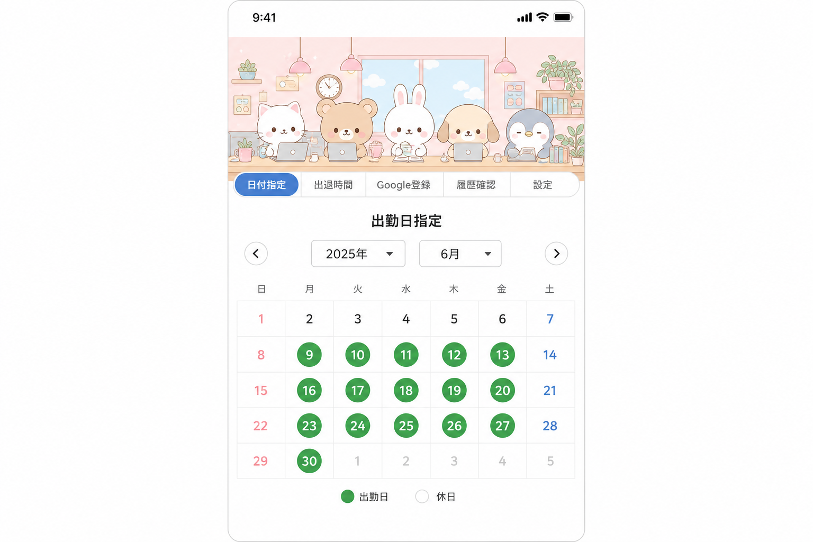
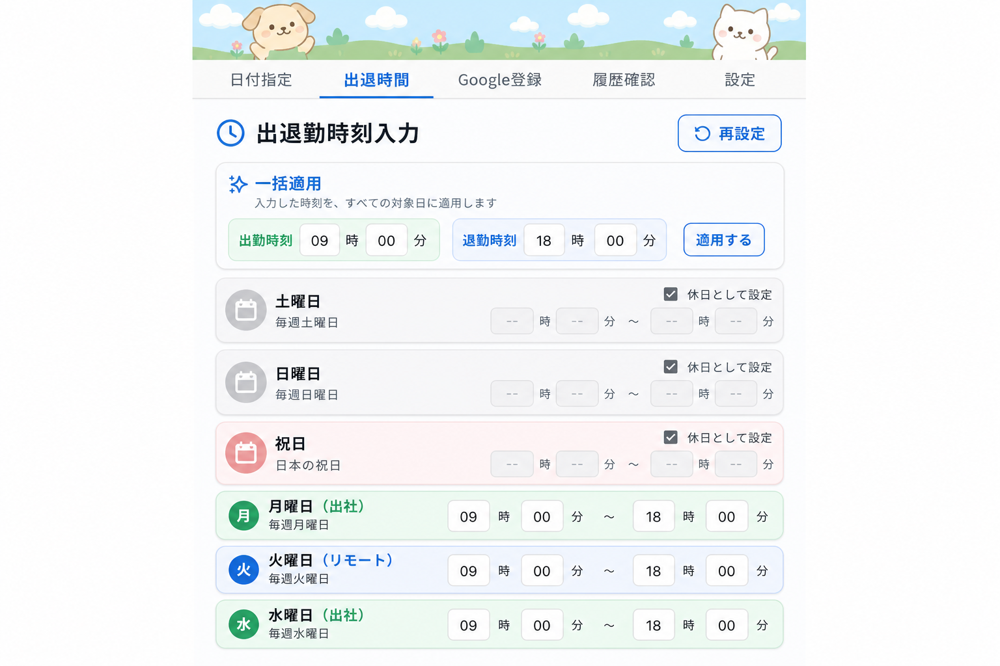
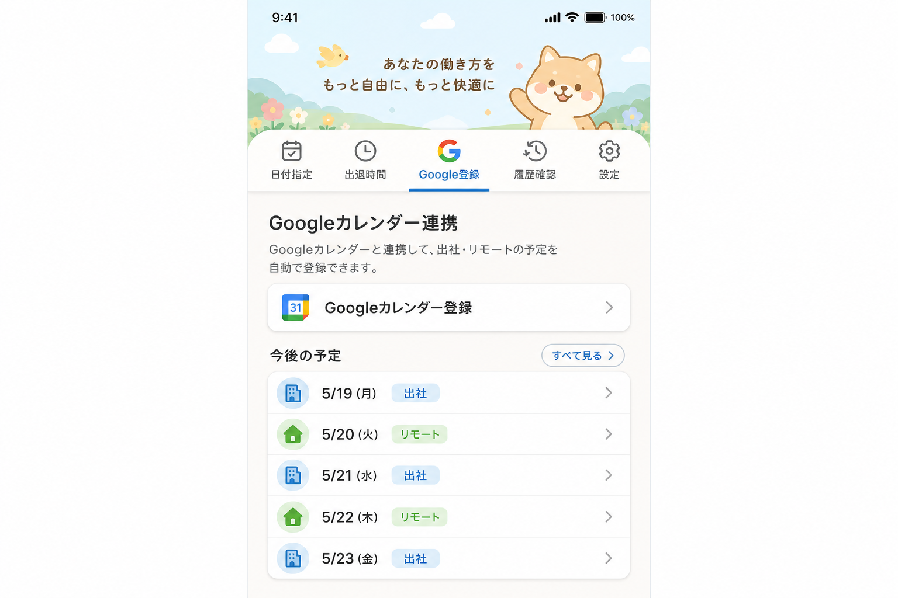
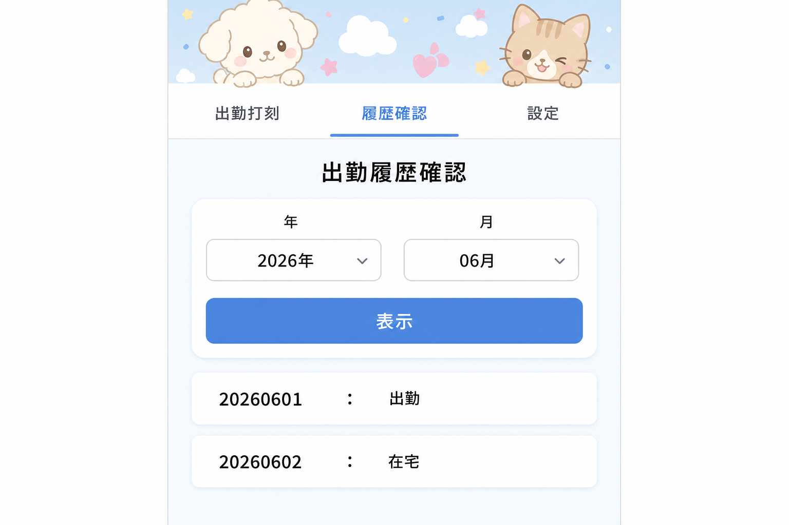

# 出退勤管理アプリ

**プログラム名:** 出退勤管理（Commute Manager）  
**バージョン:** 1.0.0  
**パッケージID:** `com.googlecalenderapp`

出勤日指定、出退勤時刻入力、Googleカレンダー連携、出勤履歴確認、設定（多言語・勤怠表CSV出力・メール送信）機能を提供する React Native モバイルアプリです。

---

## 開発環境および関連パッケージ

### 必要な開発環境

| 項目 | バージョン |
|------|-----------|
| Node.js | 18 以上（20.x 推奨） |
| npm | 8 以上 |
| JDK | 17（Android APK ビルド用） |
| Android SDK | API 34（Android 14） |
| Android Build Tools | 34.x |

### コアフレームワーク

| パッケージ | バージョン | 用途 |
|-----------|-----------|------|
| expo | ~51.0.28 | React Native フレームワーク・ビルドツール |
| react | 18.2.0 | UI ライブラリ |
| react-native | 0.74.5 | モバイルランタイム |
| typescript | ~5.3.3 | 型安全な開発 |

### ナビゲーション・UI

| パッケージ | バージョン | 用途 |
|-----------|-----------|------|
| @react-navigation/native | ^6.1.18 | アプリナビゲーション |
| @react-navigation/material-top-tabs | ^6.6.14 | 上部タブメニュー |
| react-native-tab-view | ^3.5.2 | タブビューコンポーネント |
| react-native-pager-view | 6.3.0 | スワイプ可能タブ |
| react-native-safe-area-context | 4.10.5 | セーフエリアレイアウト |
| react-native-screens | 3.31.1 | ネイティブスクリーンコンテナ |
| @react-native-picker/picker | 2.7.5 | 年月日ピッカー |

### データ・ストレージ

| パッケージ | バージョン | 用途 |
|-----------|-----------|------|
| @react-native-async-storage/async-storage | 1.23.1 | ローカルデータ永続化 |

### Googleカレンダー連携

| パッケージ | バージョン | 用途 |
|-----------|-----------|------|
| expo-auth-session | ~5.5.2 | OAuth 認証 |
| expo-web-browser | ~13.0.3 | OAuth ブラウザフロー |
| expo-crypto | ~13.0.2 | 暗号化ユーティリティ |

### 設定機能（出力・メール）

| パッケージ | バージョン | 用途 |
|-----------|-----------|------|
| expo-file-system | ~17.0.1 | CSV ファイル作成 |
| expo-sharing | ~12.0.1 | CSV ファイル共有・保存 |
| expo-mail-composer | ~13.0.1 | ネイティブメール作成 |
| expo-document-picker | ~12.0.2 | ファイル添付選択 |

### インストール・実行

```bash
nodebrew use v20.18.0   # または Node 18 以上
npm install
npm run android:emu     # Android エミュレーター
npm start               # Expo 開発サーバー
```

### APK ビルド

```bash
npm run build:apk
# 出力: dist/출퇴근관리-v1.0.0.apk
```

リポジトリにはビルド済み APK も含まれています:

```
dist/출퇴근관리-v1.0.0.apk
```

---

## 対応 Android バージョン

| | |
|---|---|
| **最小バージョン** | Android 6.0（API 23、Marshmallow） |
| **ターゲットバージョン** | Android 14（API 34） |
| **コンパイル SDK** | API 34 |

本アプリは **Android 6.0 以降** で動作します。Android 14 向けに最適化されています。

---

## 機能別説明

アプリは 5 つの上部タブメニューを提供します。デフォルト表示言語は **日本語** です（設定で韓国語・英語に変更可能）。

---

### 1. 出勤日指定

月間カレンダーで出勤日を選択します。

**使い方:**
- 年・月を選択
- 日付をタップして出勤日を指定（緑色背景）
- 同じ日付を素早く 2 回タップすると解除
- 選択した日付が下部に一覧表示されます



---

### 2. 出退勤時刻入力

出勤日・在宅日それぞれの出退勤時刻を入力します。

**使い方:**
- 年・月・日を選択
- 出勤・退勤時刻を **HH 時 MM 分** の時間入力 UI で指定
- 出勤時刻または退勤時刻の **一括登録** で当月の適用対象平日に一括適用
- 出勤日・在宅日ごとに個別修正が可能（同じ時間入力 UI）
- **保存** でデータを保存し、プレビューリストを表示

**一括登録ルール（変更）:**
- 当月の **出勤日・在宅日の両方** に適用
- **土曜日・日曜日を除く**
- **日本の祝日を除く**, 対象例:
  - 固定祝日（元日、建国記念の日、天皇誕生日 など）
  - ハッピーマンデー（海の日、敬老の日、スポーツの日）
  - 春分の日・秋分の日
  - 振替休日・国民の休日
- 画面に `土日・日本の祝日を除く · 適用対象 N日` と表示



---

### 3. Googleカレンダー連携

出勤日を Google カレンダーに登録します。

**使い方:**
- 年・月を選択
- **Googleカレンダー登録** をタップしてログインし、イベントを作成
- 画面下部に出勤日・在宅日が表示されます

**設定:** `.env` に `EXPO_PUBLIC_GOOGLE_CLIENT_ID` を設定（`.env.example` 参照）



---

### 4. 出勤履歴確認

月間の出勤履歴を確認します。

**使い方:**
- 年・月を選択
- **表示** ボタンをタップ
- 出勤日: `YYYYMMDD:出勤`
- その他の日: `YYYYMMDD:在宅`



---

### 5. 設定

言語、勤怠表出力、メール送信の設定を行います。

#### 5-1. 表示言語
**日本語・韓国語・英語** から選択。全画面が即座に切り替わります。

#### 5-2. 勤怠表出力（CSV）
- 出力する月を選択
- 昼休み時間を設定（稼働時間から除外）
- **出力** で CSV ファイルを生成・共有

**CSV 出力形式例:**
```
2026年 06月 出勤履歴
01日: 出勤時刻:09:00、退勤時刻:18:00、稼働時間:08時間00分
...
[総勤務時間:160時間00分]
```

#### 5-3. メール送信
- 宛先・件名・本文を入力
- ファイルを添付（出力した CSV も自動添付可能）
- **メール送信** で端末のメールアプリが起動します


---

## 機能変更内容

| 項目 | 内容 |
|------|------|
| デフォルト言語 | 初回起動時は **日本語** 表示（設定で韓国語・英語に変更可能） |
| 一括登録 | **土日・日本の祝日を除く** 平日のみに出退勤時刻を適用 |
| 時間入力 UI | 日別修正を **HH時MM分** の時間入力方式に変更 |
| 設定タブ | 表示言語、勤怠表 CSV 出力、メール送信（ファイル添付）を追加 |
| APK 提供 | リポジトリ `dist/출퇴근관리-v1.0.0.apk` にビルド済み APK を含む |
| 祝日計算 | `src/utils/japaneseHolidays.ts` で年別の日本祝日を自動計算 |

---

## プロジェクト構成

```
googleCalenderApp/
├── App.tsx                    # メインアプリ・タブナビゲーション
├── src/
│   ├── screens/               # 機能画面
│   ├── components/            # 共通 UI コンポーネント
│   ├── context/               # データ・言語コンテキスト
│   ├── i18n/                  # 翻訳（ja/ko/en）
│   ├── utils/                 # 日付・ストレージ・CSV・日本祝日ユーティリティ
│   └── services/              # Google Calendar API
├── docs/images/
│   ├── en/                    # 英語画面キャプチャ
│   ├── ja/                    # 日本語画面キャプチャ
│   └── ko/                    # 韓国語画面キャプチャ
├── assets/                    # アプリアイコン・スプラッシュ
├── android/                   # Android ネイティブプロジェクト
└── dist/                      # ビルド済み APK 出力
```

---

## ライセンス

プライベートプロジェクト
