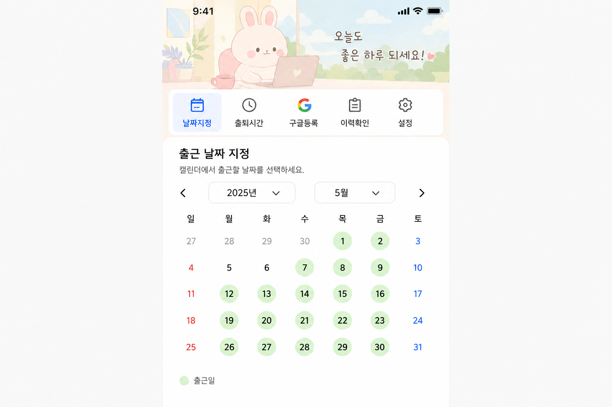
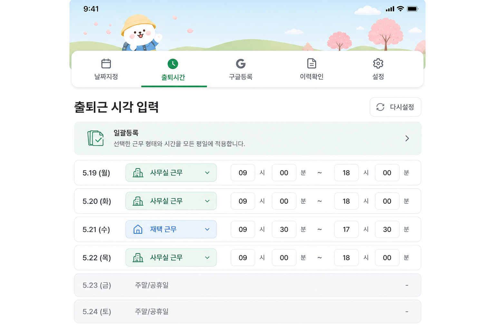
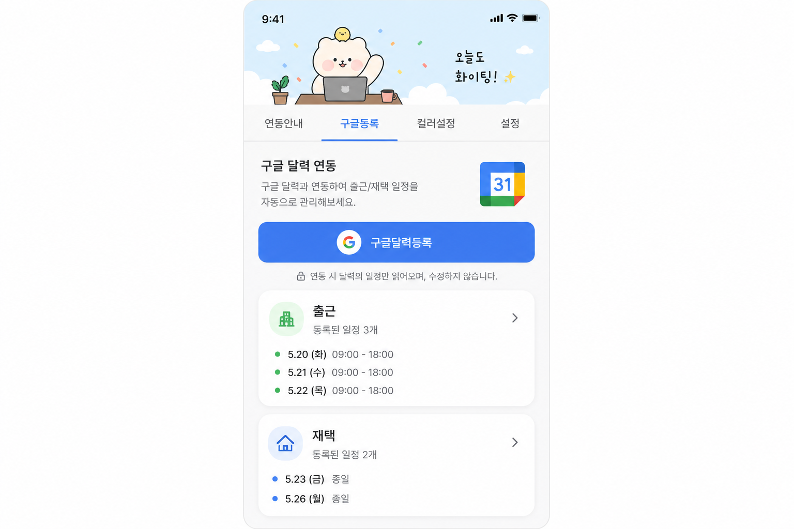
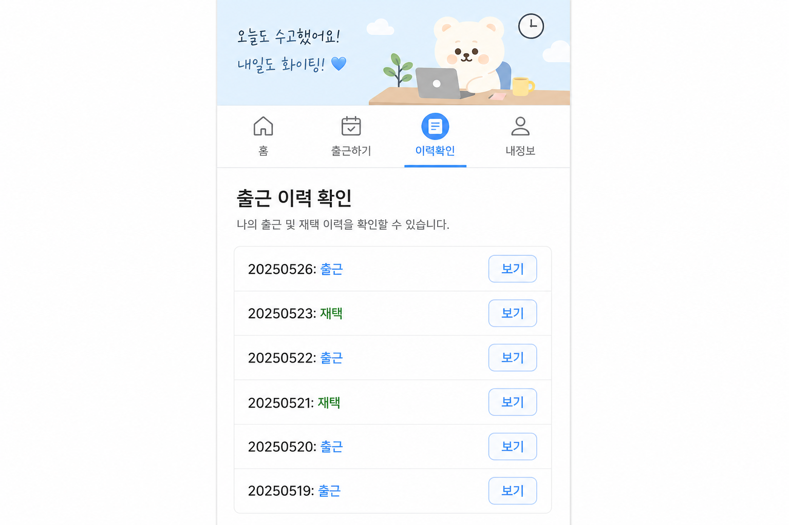
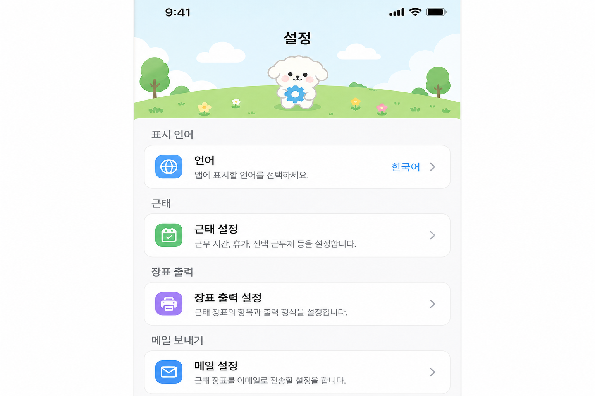

# 출퇴근 관리 앱

**프로그램 이름:** 출퇴근 관리 (Commute Manager / 出退勤管理)  
**버전:** 1.0.0  
**패키지 ID:** `com.googlecalenderapp`

출근 날짜 지정, 출퇴근 시각 입력, Google 달력 연동, 출근 이력 확인, 설정(다국어·근태장표 CSV·메일 전송) 기능을 제공하는 React Native 모바일 앱입니다.

---

## 개발환경 및 관련 패키지

### 필요한 개발환경

| 항목 | 버전 |
|------|------|
| Node.js | 18 이상 (20.x 권장) |
| npm | 8 이상 |
| JDK | 17 (Android APK 빌드용) |
| Android SDK | API 34 (Android 14) |
| Android Build Tools | 34.x |

### 핵심 프레임워크

| 패키지 | 버전 | 용도 |
|--------|------|------|
| expo | ~51.0.28 | React Native 프레임워크 및 빌드 도구 |
| react | 18.2.0 | UI 라이브러리 |
| react-native | 0.74.5 | 모바일 런타임 |
| typescript | ~5.3.3 | 타입 안전 개발 |

### 내비게이션 및 UI

| 패키지 | 버전 | 용도 |
|--------|------|------|
| @react-navigation/native | ^6.1.18 | 앱 내비게이션 |
| @react-navigation/material-top-tabs | ^6.6.14 | 상단 탭 메뉴 |
| react-native-tab-view | ^3.5.2 | 탭 뷰 컴포넌트 |
| react-native-pager-view | 6.3.0 | 스와이프 가능 탭 |
| react-native-safe-area-context | 4.10.5 | 세이프 에리어 레이아웃 |
| react-native-screens | 3.31.1 | 네이티브 스크린 컨테이너 |
| @react-native-picker/picker | 2.7.5 | 년·월·일 선택기 |

### 데이터 및 저장소

| 패키지 | 버전 | 용도 |
|--------|------|------|
| @react-native-async-storage/async-storage | 1.23.1 | 로컬 데이터 영구 저장 |

### Google 달력 연동

| 패키지 | 버전 | 용도 |
|--------|------|------|
| expo-auth-session | ~5.5.2 | OAuth 인증 |
| expo-web-browser | ~13.0.3 | OAuth 브라우저 흐름 |
| expo-crypto | ~13.0.2 | 암호화 유틸리티 |

### 설정 기능 (출력 및 메일)

| 패키지 | 버전 | 용도 |
|--------|------|------|
| expo-file-system | ~17.0.1 | CSV 파일 생성 |
| expo-sharing | ~12.0.1 | CSV 파일 공유·저장 |
| expo-mail-composer | ~13.0.1 | 네이티브 메일 작성 |
| expo-document-picker | ~12.0.2 | 파일 첨부 선택 |

### 설치 및 실행

```bash
nodebrew use v20.18.0   # 또는 Node 18 이상
npm install
npm run android:emu     # Android 에뮬레이터
npm start               # Expo 개발 서버
```

### APK 빌드

```bash
npm run build:apk
# 출력: dist/출퇴근관리-v1.0.0.apk
```

저장소에 빌드된 APK 파일도 포함되어 있습니다:

```
dist/출퇴근관리-v1.0.0.apk
```

---

## 지원 가능한 안드로이드 버전

| | |
|---|---|
| **최소 버전** | Android 6.0 (API 23, Marshmallow) |
| **타겟 버전** | Android 14 (API 34) |
| **컴파일 SDK** | API 34 |

본 앱은 **Android 6.0 이상** 에서 동작합니다. Android 14에 최적화되어 있습니다.

---

## 기능별 설명

앱은 **상단 귀여운 배너**와 배너 이미지 위 **5개 링크 버튼 메뉴**로 구성됩니다. 메뉴 이름은 **날짜지정 · 출퇴시간 · 구글등록 · 이력확인 · 설정** 입니다. 기본 표시 언어는 **일본어** 이며, 설정에서 한국어·영어로 변경할 수 있습니다.

---

### 1. 출근 날짜 지정

월간 달력에서 출근일을 선택합니다.

**사용 방법:**
- 년·월 선택
- 날짜를 탭하여 출근일 지정 (녹색 배경)
- 같은 날짜를 빠르게 두 번 탭하면 해제
- 선택된 날짜가 하단에 목록으로 표시됩니다



---

### 2. 출퇴근 시각 입력

출근일·재택일 각각의 출퇴근 시각을 입력합니다.

**사용 방법:**
- 년·월·일 선택
- 출근·퇴근 시각을 **HH시 MM분** 시간 입력 UI로 지정
- 출근 시각 또는 퇴근 시각 옆 **일괄등록** 으로 해당 월 적용 대상 평일에 일괄 적용
- 출근일·재택일별 개별 수정 가능 (동일한 시간 입력 UI)
- 타이틀 오른쪽 **다시설정** 버튼으로 해당 월 출근일·재택일 시간을 **00:00** 으로 초기화
- **저장** 으로 데이터 저장 및 미리보기 목록 표시

**일괄등록 규칙 (변경):**
- 해당 월의 **출근일·재택일 모두** 에 적용
- **토요일·일요일 제외**
- **일본 공휴일(祝日) 제외**, 포함 항목:
  - 고정 공휴일 (元日, 建国記念の日, 天皇誕生日 등)
  - 해피 먼데이 (海の日, 敬老の日, スポーツの日)
  - 춘분의日·추분의日
  - 대체 공휴일 (振替休日), 국민의 휴일 (国民の休日)
- 화면에 `토·일 및 일본 공휴일 제외 · 적용 대상 N일` 안내 표시
- **토·일·일본 공휴일** 날짜 카드는 **회색 배경**으로 표시 (출근·재택 구분과 별도)



---

### 3. 구글 달력 연동

출근일을 Google 달력에 등록합니다.

**사용 방법:**
- 년·월 선택
- **구글달력등록** 버튼으로 로그인 후 이벤트 생성
- 화면 하단에 출근일·재택일이 표시됩니다

**설정:** `.env` 파일에 `EXPO_PUBLIC_GOOGLE_CLIENT_ID` 설정 (`.env.example` 참고)



---

### 4. 출근 이력 확인

월간 출근 이력을 확인합니다.

**사용 방법:**
- 년·월 선택
- **보기** 버튼 클릭
- 출근일: `YYYYMMDD:출근`
- 그 외 날짜: `YYYYMMDD:재택`



---

### 5. 설정

언어, 근태장표 출력, 메일 보내기 설정을 합니다.

#### 5-1. 화면표시언어
**일본어·한국어·영어** 중 선택. 모든 화면이 즉시 변경됩니다.

#### 5-2. 근태장표 출력 (CSV)
- 출력할 달 선택
- 점심시간 설정 (가동시간에서 제외)
- **출력** 버튼으로 CSV 파일 생성 및 공유

**CSV 출력 형식 예시:**
```
2026년 06월 출근 이력
01일: 출근시각:09:00、퇴근시각:18:00、가동시간:08시간00분
...
[총근무시간:160시간00분]
```

#### 5-3. 메일 보내기
- 받는 주소, 제목, 본문 입력
- 파일 첨부 (출력한 CSV도 자동 첨부 가능)
- **메일 보내기** 로 기기 메일 앱 실행



---

## 기능 변경 내역

| 항목 | 내용 |
|------|------|
| 기본 언어 | 앱 최초 실행 시 **일본어** 표시 (설정에서 한국어·영어 변경 가능) |
| 일괄등록 | **토·일 및 일본 공휴일 제외** 후 평일에만 출퇴근 시각 적용 |
| 시간 입력 UI | 날짜별 수정 시 **HH시 MM분** 시간 입력 방식으로 변경 |
| 설정 탭 | 화면표시언어, 근태장표 CSV 출력, 메일 보내기(첨부파일) 추가 |
| APK 제공 | 저장소 `dist/출퇴근관리-v1.0.0.apk` 에 빌드 파일 포함 |
| 공휴일 계산 | `src/utils/japaneseHolidays.ts` 에서 연도별 일본 공휴일 자동 계산 |
| 앱 레이아웃 | 상단 **귀여운 배너** + 배너 위 **링크 버튼 메뉴** 로 UI 변경 |
| 메뉴 이름 | **날짜지정 · 출퇴시간 · 구글등록 · 이력확인 · 설정** 으로 단축 |
| 휴일 표시 | 출퇴근 시각 화면에서 토·일·공휴일 카드 **회색 배경** 표시 |
| 다시설정 | 출퇴근 시각 화면 타이틀 옆 **다시설정** 으로 시간 **00:00** 초기화 |

---

## 프로젝트 구조

```
googleCalenderApp/
├── App.tsx                    # 메인 앱 및 탭 내비게이션
├── src/
│   ├── screens/               # 기능 화면
│   ├── components/            # 배너, 달력 등 공통 UI
│   ├── context/               # 데이터·언어 컨텍스트
│   ├── i18n/                  # 번역 (ja/ko/en)
│   ├── utils/                 # 날짜·저장소·CSV·일본 공휴일 유틸리티
│   └── services/              # Google Calendar API
├── docs/images/
│   ├── en/                    # 영어 화면 캡처
│   ├── ja/                    # 일본어 화면 캡처
│   └── ko/                    # 한국어 화면 캡처
├── assets/                    # 앱 아이콘, 배너 및 스플래시
├── android/                   # Android 네이티브 프로젝트
└── dist/                      # 빌드된 APK 출력
```

---

## 라이선스

비공개 프로젝트
