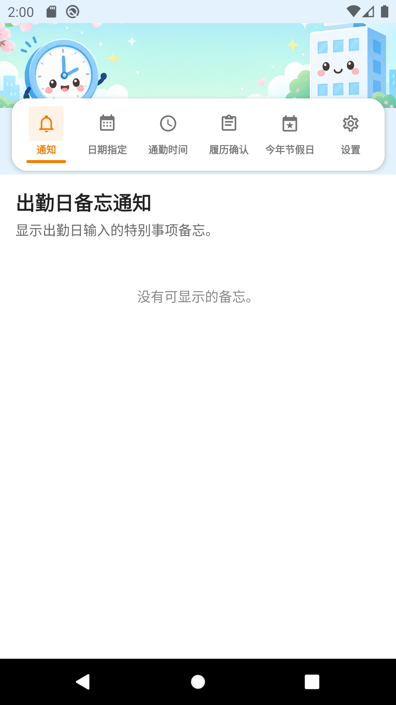
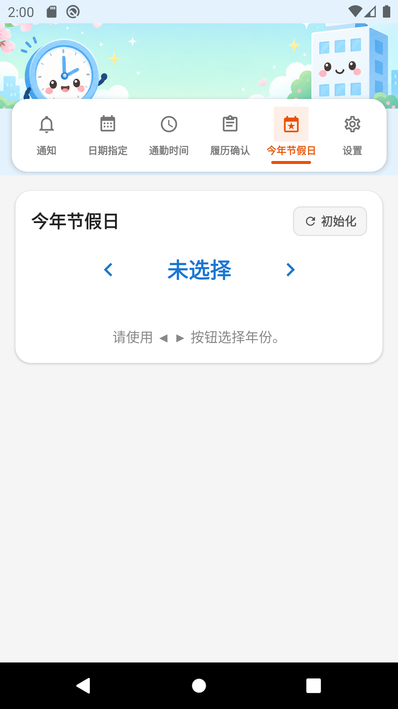

# 출퇴근 관리 앱

**프로그램 이름:** 출퇴근 관리 (Commute Manager / 出退勤管理)  
**버전:** 1.0.0  
**패키지 ID:** `com.googlecalenderapp`

출근 날짜 지정, 출퇴근 시각 입력, Google 달력 연동, 출근 이력 확인, 설정(다국어·근태장표 CSV·메일 전송) 기능을 제공하는 React Native 모바일 앱입니다.

---

## 개발환경 및 관련 패키지

### 필요한 개발환경

| 항목 | 버전 |
|------|------|
| Node.js | 18 이상 (20.x 권장) |
| npm | 8 이상 |
| JDK | 17 (Android APK 빌드용) |
| Android SDK | API 34 (Android 14) |
| Android Build Tools | 34.x |

### 핵심 프레임워크

| 패키지 | 버전 | 용도 |
|--------|------|------|
| expo | ~51.0.28 | React Native 프레임워크 및 빌드 도구 |
| react | 18.2.0 | UI 라이브러리 |
| react-native | 0.74.5 | 모바일 런타임 |
| typescript | ~5.3.3 | 타입 안전 개발 |

### 내비게이션 및 UI

| 패키지 | 버전 | 용도 |
|--------|------|------|
| @react-navigation/native | ^6.1.18 | 앱 내비게이션 |
| @react-navigation/material-top-tabs | ^6.6.14 | 상단 탭 메뉴 |
| react-native-tab-view | ^3.5.2 | 탭 뷰 컴포넌트 |
| react-native-pager-view | 6.3.0 | 스와이프 가능 탭 |
| react-native-safe-area-context | 4.10.5 | 세이프 에리어 레이아웃 |
| react-native-screens | 3.31.1 | 네이티브 스크린 컨테이너 |
| @react-native-picker/picker | 2.7.5 | 년·월·일 선택기 |

### 데이터 및 저장소

| 패키지 | 버전 | 용도 |
|--------|------|------|
| @react-native-async-storage/async-storage | 1.23.1 | 로컬 데이터 영구 저장 |

### Google 달력 연동

| 패키지 | 버전 | 용도 |
|--------|------|------|
| expo-auth-session | ~5.5.2 | OAuth 인증 |
| expo-web-browser | ~13.0.3 | OAuth 브라우저 흐름 |
| expo-crypto | ~13.0.2 | 암호화 유틸리티 |

### 설정 기능 (출력 및 메일)

| 패키지 | 버전 | 용도 |
|--------|------|------|
| expo-file-system | ~17.0.1 | CSV 파일 생성 |
| expo-sharing | ~12.0.1 | CSV 파일 공유·저장 |
| expo-mail-composer | ~13.0.1 | 네이티브 메일 작성 |
| expo-document-picker | ~12.0.2 | 파일 첨부 선택 |

### 설치 및 실행

```bash
nodebrew use v20.18.0   # 또는 Node 18 이상
npm install
npm run android:emu     # Android 에뮬레이터
npm start               # Expo 개발 서버
```

### APK 빌드

```bash
npm run build:apk
# 출력: dist/出退勤管理-v1.0.0.apk
```

저장소에 빌드된 APK 파일도 포함되어 있습니다:

```
dist/出退勤管理-v1.0.0.apk
```

---

## 지원 가능한 안드로이드 버전

| | |
|---|---|
| **최소 버전** | Android 6.0 (API 23, Marshmallow) |
| **타겟 버전** | Android 14 (API 34) |
| **컴파일 SDK** | API 34 |

본 앱은 **Android 6.0 이상** 에서 동작합니다. Android 14에 최적화되어 있습니다.

---

## 기능별 설명

앱은 **상단 귀여운 배너**와 배너 이미지 위 **6개 링크 버튼 메뉴**로 구성됩니다. 메뉴 이름은 **알림 · 날짜지정 · 출퇴시간 · 이력확인 · 올해휴일 · 설정** 입니다. 기본 표시 언어는 **일본어** 이며, 설정에서 **중국어·한국어·영어**로 변경할 수 있습니다.

**다른 언어 매뉴얼:** [日本語](README_JP.md) · [中文](README_ZH.md) · [English](README.md)

---

### 1. 알림 (출근일 메모)

출근일에 입력한 특이사항 메모를 날짜별 카드로 표시합니다.

**사용 방법:**
- **날짜지정**에서 출근일로 지정하고 **출퇴시간** 화면에서 메모를 입력·저장한 날만 표시
- 형식: `YYYY/MM/DD(요일):출근종류(출근시각)` / `메모:내용`
- 출근시각은 출퇴시간 저장값 우선, 없으면 설정의 출근 유형 기본 시각
- 예:
```
2026/06/11(목요일):정상출근(09:00)
메모:당일 혼방데이터 수정 릴리즈 작업있음
```
- 최신 날짜가 위에 표시



---

### 2. 출근 날짜 지정

월간 달력에서 출근일을 선택합니다.

**사용 방법:**
- **년·월** 을 출근 이력 확인 화면과 동일한 드롭다운 선택기로 지정
- 날짜를 탭하여 출근일 지정 (녹색 동그라미)
- 같은 날짜를 빠르게 두 번 탭하면 해제
- **일본 공휴일** 은 달력에 **빨간 동그라미** 로 표시
- 하단 범례: 녹색 = 출근일, 빨간색 = 휴일


---

### 3. 출퇴근 시각 입력

선택한 월의 각 날짜별 출퇴근 시각을 입력합니다.

**사용 방법:**
- **년·월** 을 출근 이력 확인 화면과 동일한 드롭다운 선택기로 지정
- **일괄적용** 영역에서 출근·퇴근 시각 입력 후 **적용하기** 버튼 탭 (저장 버튼과 동일한 **전체 폭**)
- 날짜별로 컴팩트 **HH시 MM분** 입력 UI로 개별 수정
- 각 날짜 **메모** 항목에 특이사항 입력 가능
- 타이틀 오른쪽 **다시설정** 버튼으로 해당 월 전체 시간을 **00:00** 으로 초기화
- **저장** 으로 데이터 저장 후 저장 버튼 아래 미리보기 목록 표시

**저장 미리보기 (출근 이력 확인과 동일 형식):**
- **첫 줄:** `[가동시간:합산시간]` — 저장된 일별 가동시간 합계 (소수 1자리)
- 각 행: `YYYY/MM/DD(요일) HH:MM-HH:MM (가동시간)`, **가운데 정렬**
- 가동시간 = 퇴근 시각 − 출근 시각 − **설정의 점심·저녁 휴계시간**, 괄호 안에 소수로 표시 (9시간 → `(9.0)`, 9시간 30분 → `(9.5)`)
- 예:
```
[가동시간:160.0]
2026/06/03(수) 09:00-18:00 (8.0)
2026/06/04(목) 09:00-18:00 (8.0)
```

**날짜 표시 및 카드 색상:**
- 각 행은 `YYYY/MM/DD(요일):유형` 형식 (예: `2026/06/03(수):출근`)
- **평일, 달력 미지정** → `:재택` (파란 카드)
- **평일, 출근일 지정** → `:출근` (녹색 카드)
- **토·일·공휴일, 달력 미지정** → `:공휴일` (분홍 카드) — 재택이 아님
- **토·일·공휴일, 출근일로 지정** → 기본 `:출근` (녹색 카드); 날짜 라벨(▼) 탭 시 팝업에서 **출근/재택** 전환 가능

**일괄적용 규칙:**
- 해당 월의 적용 대상 **평일** (출근·재택 평일 모두) 에 적용
- **토요일·일요일·일본 공휴일(祝日) 제외**, 포함 항목:
  - 고정 공휴일, 해피 먼데이, 춘분의日·추분의日
  - 대체 공휴일 (振替休日), 국민의 휴일 (国民の休日)
- 화면에 `토·일 및 일본 공휴일 제외 · 적용 대상 N일` 안내 표시


---

### 4. 출근 이력 확인

월간 출근 이력을 확인합니다.

**사용 방법:**
- 드롭다운으로 년·월 선택
- 선택한 월의 목록이 자동으로 표시됨
- **첫 줄:** `[가동시간:합산시간]` — 해당 월 일별 가동시간 합계
- 각 행: `YYYY/MM/DD(요일) HH:MM-HH:MM (가동시간)` 형식, **가운데 정렬**
- 괄호 안 가동시간은 저장 미리보기와 동일 (점심·저녁 휴계시간 제외, `9.0` / `9.5` 형식)
- 예:
```
[가동시간:160.0]
2026/06/03(수) 09:00-18:00 (8.0)
2026/06/04(목) 09:00-18:00 (8.0)
```
- 카드 색상은 출퇴근 시각 화면과 동일: 녹색 = 출근, 파란색 = 재택, 분홍색 = 공휴일


---

### 5. 올해 휴일

일본 공휴일을 년·월 단위로 확인합니다.

**사용 방법:**
- **초기화** 로 년·월 선택 해제
- ◀ ▶ 로 년도 선택 (처음은 미선택)
- 년도만 선택 시 1년치 공휴일 목록: `YYYY/MM/DD(요일):공휴일명`
- 월까지 선택 시 해당 월 달력 + 공휴일 표시
- 대체휴일·국민의 휴일 구분 표시



---

### 6. 설정

화면표시언어, 출근 유형, 휴계시간, 근태장표출력(CSV), 메일 보내기를 설정합니다.

#### 6-1. 화면표시언어
**일본어 · 중국어 · 한국어 · 영어** 순으로 선택. 모든 화면이 즉시 변경됩니다.

#### 6-2. 휴계시간 설정
- 카드: **휴계시간설정(점심,저녁)** (카테고리: 휴계시간 설정)
- **점심시간 (가동시간 제외)** — 기본값 **1시간** (`01:00`)
- **저녁시간 (가동시간 제외)** — 기본값 **0시간** (`00:00`)
- 점심·저녁 **시·분** 을 각각 독립적으로 입력 (HH시 MM분)
- 카드를 열면 마지막 저장값이 표시되며, 저녁시간 입력란 아래 **저장** 버튼(전체 폭)으로 점심·저녁을 한 번에 저장
- 저장된 휴계시간은 이력확인·저장 미리보기·CSV 출력 시 가동시간 계산에서 합산 제외

#### 6-3. 근태장표출력(CSV)
- 출력할 달 선택
- **출력** 버튼(전체 폭)으로 CSV 파일 생성 및 공유 (§5-2 휴계시간 설정 반영)

**CSV 출력 형식 예시:**
```
2026년 06월 출근 이력
01일: 출근시각:09:00、퇴근시각:18:00、가동시간:08시간00분
...
[총근무시간:160시간00분]
```

#### 6-4. 메일 보내기
- 받는 주소, 제목, 본문 입력
- 파일 첨부 (출력한 CSV도 자동 첨부 가능)
- **메일 보내기** 버튼(전체 폭)으로 기기 메일 앱 실행


---

## 기능 변경 내역

| 항목 | 내용 |
|------|------|
| 메뉴 구성 | **알림 · 날짜지정 · 출퇴시간 · 이력확인 · 올해휴일 · 설정** (6개 탭) |
| 알림 메뉴 | 출근일 **메모**를 `YYYY/MM/DD(요일):출근종류(출근시각)` / `메모:내용` 형식으로 표시 |
| 올해휴일 메뉴 | 년·월 선택으로 일본 공휴일 목록·달력 표시 (대체휴일·국민의 휴일 구분) |
| 날짜별 메모 | 출퇴근 시각 화면 각 날짜에 **메모** 입력·저장 (특이사항) |
| 표시언어 | **일본어 · 중국어 · 한국어 · 영어** 지원 (설정 선택 순서 동일) |
| 중국어 매뉴얼 | [README_ZH.md](README_ZH.md) 추가, `docs/images/zh/` 화면 캡처 포함 |
| 화면 캡처 | ja/ko/en/zh 4개 언어 × 6개 화면 갱신 (`scripts/capture-manual-screenshots.sh`) |
| 구글등록 탭 | 제거 (설정·이력·출퇴 기능은 유지) |
| 기본 언어 | 앱 최초 실행 시 **일본어** 표시 |
| 출근 유형 | 정상/일찍/늦게/재택/휴가, 색상·출근 시각 설정 가능 |
| 달력 공휴일 | 날짜지정 달력에 일본 공휴일 **빨간 동그라미** 표시 |
| 출퇴 유형 표시 | 토·일·공휴일 미지정 시 **:공휴일**, 지정 시 출근/재택 전환 가능 |
| 가동시간 | 이력·저장 미리보기 **`[가동시간:합산]`** 및 일별 `(9.0)` 형식 (휴계시간 제외) |
| 일괄적용 | **토·일 및 일본 공휴일 제외** 후 평일에만 출퇴근 시각 적용 |
| 다시설정 | 출퇴근 시각 화면 **다시설정** 으로 해당 월 시간·메모 초기화 |
| APK 제공 | 저장소 `dist/出退勤管理-v1.0.0.apk` 에 빌드 파일 포함 |

---

## 프로젝트 구조

```
googleCalenderApp/
├── App.tsx                    # 메인 앱 및 탭 내비게이션
├── src/
│   ├── screens/               # 기능 화면
│   ├── components/            # 배너, 달력 등 공통 UI
│   ├── context/               # 데이터·언어 컨텍스트
│   ├── i18n/                  # 번역 (ja/zh/ko/en)
│   ├── utils/                 # 날짜·저장소·CSV·공휴일·출퇴 유형 유틸리티
│   └── services/              # Google Calendar API
├── docs/images/
│   ├── ja/                    # 일본어 화면 캡처
│   ├── zh/                    # 중국어 화면 캡처
│   ├── ko/                    # 한국어 화면 캡처
│   └── en/                    # 영어 화면 캡처
├── assets/                    # 앱 아이콘, 배너 및 스플래시
├── android/                   # Android 네이티브 프로젝트
└── dist/                      # 빌드된 APK 출력
```

---

## 라이선스

비공개 프로젝트
