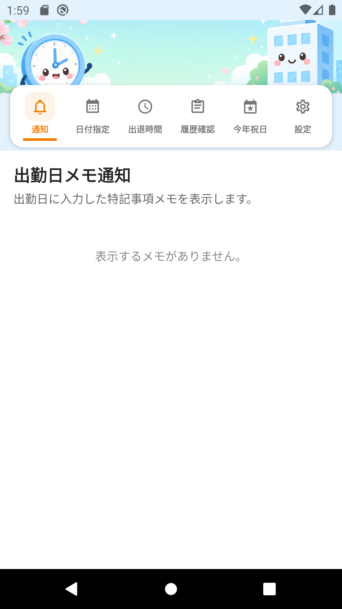
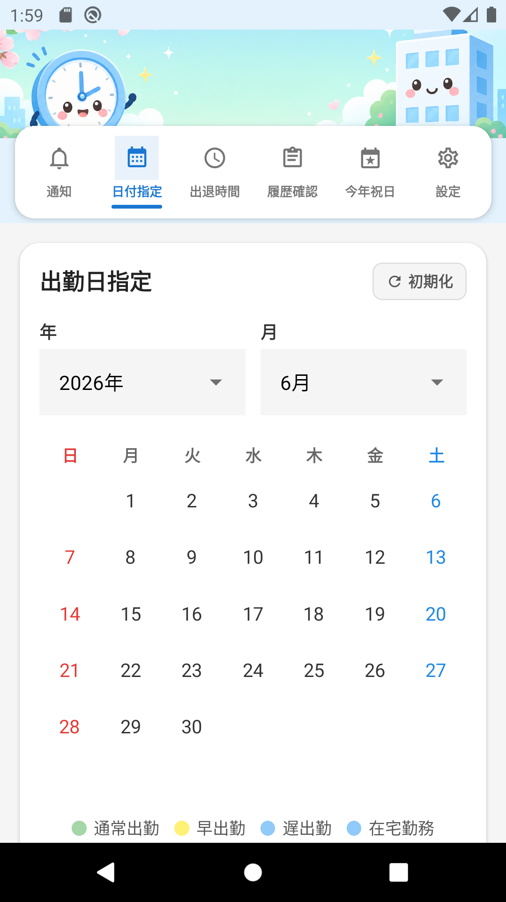
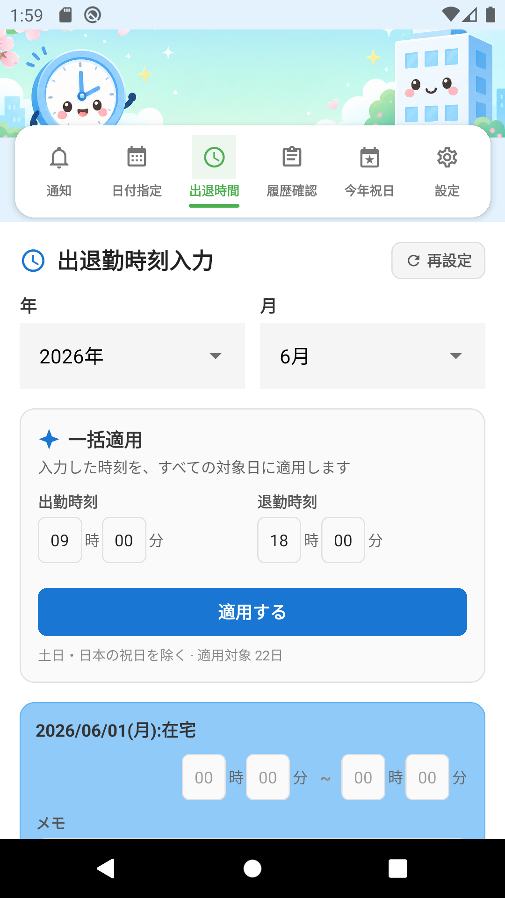
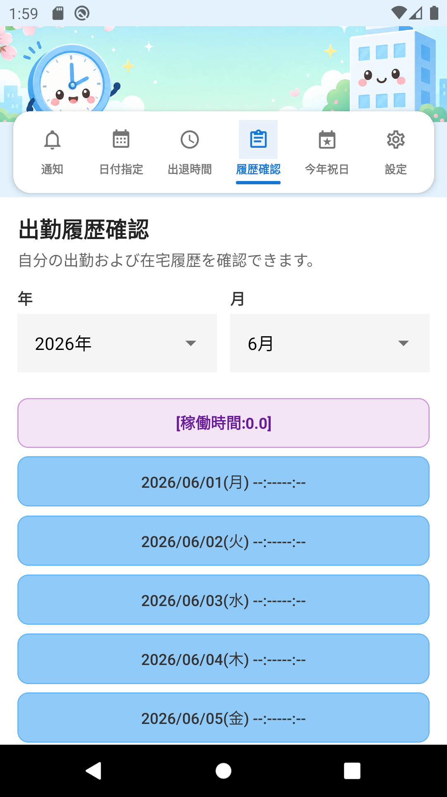
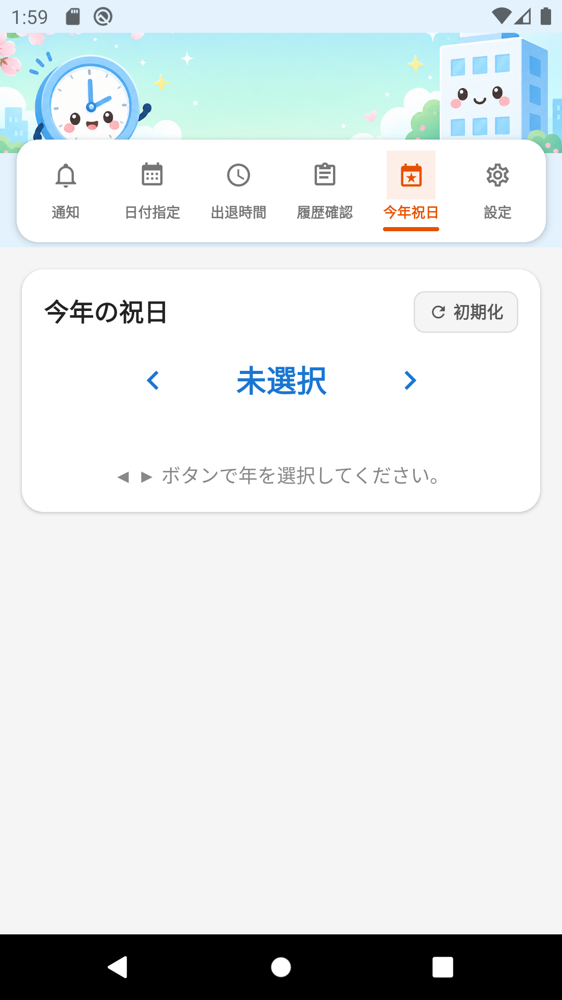
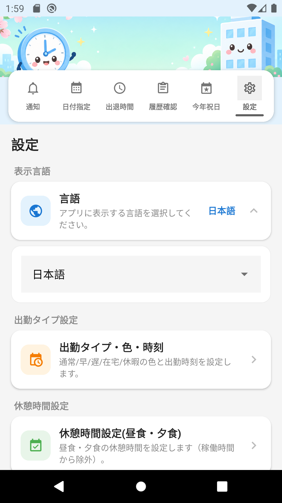

# 出退勤管理应用

**程序名称:** 出退勤管理（Commute Manager / 출퇴근 관리）  
**版本:** 1.0.0  
**包 ID:** `com.googlecalenderapp`

用于指定出勤日期、输入通勤时间、查看出勤履历、今年节假日、出勤日备忘通知，以及设置（多语言·考勤报表 CSV·邮件发送）的 React Native 移动应用。

---

## 开发环境及相关包

### 所需开发环境

| 项目 | 版本 |
|------|------|
| Node.js | 18 以上（推荐 20.x） |
| npm | 8 以上 |
| JDK | 17（Android APK 构建用） |
| Android SDK | API 34（Android 14） |
| Android Build Tools | 34.x |

### 安装与运行

```bash
nodebrew use v20.18.0   # 或 Node 18 以上
npm install
npm run android:emu     # Android 模拟器
npm start               # Expo 开发服务器
```

### 构建 APK

```bash
npm run build:apk
# 输出: dist/出退勤管理-v1.0.0.apk
```

仓库中也包含已构建的 APK：

```
dist/出退勤管理-v1.0.0.apk
```

---

## 支持的 Android 版本

| | |
|---|---|
| **最低版本** | Android 6.0（API 23, Marshmallow） |
| **目标版本** | Android 14（API 34） |
| **编译 SDK** | API 34 |

本应用在 **Android 6.0 及以上** 运行，针对 Android 14 优化。

---

## 功能说明

应用由 **顶部可爱横幅** 和横幅上的 **6 个链接按钮菜单** 组成。菜单名称为 **通知 · 日期指定 · 通勤时间 · 履历确认 · 今年节假日 · 设置**。默认显示语言为 **日语**，可在设置中切换为 **中文、韩语或英语**。

---

### 1. 通知（出勤日备忘）

显示出勤日输入的特别事项备忘。

**使用方法:**
- 仅显示已在 **日期指定** 中登记为出勤日、且在 **通勤时间** 中输入了备忘的日期
- 每个日期以卡片列表显示，格式如下：

```
2026/06/11(星期四):正常出勤(09:00)
备忘:当日混纺数据修改发布作业
```
- 上班时间优先使用通勤时间保存值，否则使用设置中的出勤类型默认时间

- 按日期从新到旧排序
- 无备忘时显示「没有可显示的备忘。」



---

### 2. 日期指定（出勤日指定）

在月历中选择出勤日。

**使用方法:**
- 用与履历确认画面相同的下拉选择器指定 **年·月**
- 先选择出勤类型（正常出勤 / 早出勤 / 晚出勤 / 居家办公 / 休假），再点击日期登记
- 快速双击同一日期可取消
- **日本节假日** 在日历上以 **红色圆圈** 显示
- 标题旁 **初始化** 按钮可清除当月所有出勤日登记
- 退勤时间自动设为上班 + 8 小时



---

### 3. 通勤时间输入

输入所选月份每日的上下班时间。

**使用方法:**
- 用下拉选择器指定 **年·月**
- 在 **批量应用** 区域输入上班·下班时间后点击 **应用**（与 **保存** 同宽）
- 各日期可用紧凑的 **时·分** 输入框单独修改
- 各日期下方 **备忘** 栏可输入特别事项
- 标题旁 **重新设置** 可将当月全部时间重置为 **00:00**（备忘一并清除）
- 点击 **保存** 后，保存按钮下方显示预览列表

**保存预览（与履历确认相同格式）:**
- **首行:** `[工作时间:合计时间]` — 已保存日别工作时间合计（小数 1 位）
- 各行: `YYYY/MM/DD(星期) HH:MM-HH:MM (工作时间)`，**居中**
- 工作时间 = 下班 − 上班 − **设置中的午餐·晚餐休息时间**，括号内以小数显示
- 有备忘时追加 `[备忘:内容]`

**日期显示与卡片颜色:**
- 每行格式 `YYYY/MM/DD(星期):类型`
- **平日，日历未指定** → `:居家`（蓝色卡片）
- **平日，已指定出勤** → `:出勤`（绿色卡片）
- **周六日·节假日，未指定** → `:节假日`（粉色卡片）
- **周六日·节假日，已指定出勤** → 默认 `:出勤`；点击日期标签（▼）可在弹窗中切换 **出勤/居家**

**批量应用规则:**
- 适用于当月符合条件的 **平日**
- **排除周六、周日及日本节假日**（含补休、国民休假日）
- 画面显示 `排除周六日及日本节假日 · 适用对象 N天`



---

### 4. 履历确认（出勤履历）

查看月度出勤履历。

**使用方法:**
- 下拉选择年·月
- 所选月份列表自动显示
- **首行:** `[工作时间:合计时间]`
- 各行: `YYYY/MM/DD(星期) HH:MM-HH:MM (工作时间)`，**居中**
- 卡片颜色与通勤时间画面相同



---

### 5. 今年节假日

查看日本法定节假日。

**使用方法:**
- 顶部 **初始化** 清除年·月选择
- **◀ ▶** 按钮选择年份（初始为未选择）
- 选择年份后显示 1～12 月按钮
- **仅选年份** → 下方显示全年节假日列表：`YYYY/MM/DD(星期):节假日名`
- **年份 + 月份** → 显示该月日历（节假日标红）及当月节假日列表
- **补休** 显示为「补休」，**国民休假日** 显示为「国民休假日」



---

### 6. 设置

显示语言、休息时间、出勤类型、考勤报表（CSV）、邮件发送等。

#### 6-1. 显示语言
可选 **日语 · 中文 · 韩语 · 英语**（按此顺序显示）。所有画面立即切换。

#### 6-2. 出勤类型·颜色·时间
设置正常/早/晚/居家/休假的颜色和上班时间。

#### 6-3. 休息时间设置
- **午餐时间（从工作时间扣除）** — 默认 **1 小时**
- **晚餐时间（从工作时间扣除）** — 默认 **0 小时**
- 点击 **保存** 一并保存午餐·晚餐

#### 6-4. 考勤报表导出（CSV）
- 选择导出月份
- 点击 **导出** 生成并共享 CSV（反映休息时间设置）

#### 6-5. 发送邮件
- 输入收件人、主题、正文
- 可附加文件（含导出的 CSV）
- 点击 **发送邮件** 打开设备邮件应用



---

## 功能更新

| 项目 | 内容 |
|------|------|
| 菜单构成 | **通知 · 日期指定 · 通勤时间 · 履历确认 · 今年节假日 · 设置**（6 个标签） |
| 通知菜单 | 出勤日 **备忘** 以 `YYYY/MM/DD(星期):出勤类型(上班时间)` / `备忘:内容` 显示 |
| 今年节假日 | 按年/月查看日本节假日列表与月历（补休·国民休假日区分） |
| 日期备忘 | 通勤时间画面各日期可输入·保存 **备忘**（特别事项） |
| 显示语言 | 支持 **日语 · 中文 · 韩语 · 英语**（设置选择顺序相同） |
| 中文手册 | [README_ZH.md](README_ZH.md) 新增，`docs/images/zh/` 含 6 张界面截图 |
| 界面截图 | ja/ko/en/zh 四种语言各 6 张截图已更新（`scripts/capture-manual-screenshots.sh`） |
| Google 标签 | 已移除（设置·履历·通勤功能保留） |
| 出勤类型 | 正常/早/晚/居家/休假，颜色与上班时间可设置 |
| 批量应用 | 排除周六日及日本节假日后应用于平日 |
| 工作时间 | 履历·保存预览显示 **`[工作时间:合计]`** 及每日 `(9.0)` 格式 |
| 重新设置 | 通勤时间 **重新设置** 可初始化当月时间与备忘 |
| APK | 仓库 `dist/出退勤管理-v1.0.0.apk` 含构建文件 |

---

## 项目结构

```
googleCalenderApp/
├── App.tsx                    # 主应用及标签导航
├── src/
│   ├── screens/               # 功能画面
│   ├── components/            # 横幅、日历等通用 UI
│   ├── context/               # 数据·语言上下文
│   ├── i18n/                  # 翻译（ja/zh/ko/en）
│   └── utils/                 # 日期·存储·CSV·节假日等工具
├── docs/images/
│   ├── ja/                    # 日语画面截图
│   ├── zh/                    # 中文画面截图
│   ├── ko/                    # 韩语画面截图
│   └── en/                    # 英语画面截图
├── assets/                    # 应用图标、横幅
├── android/                   # Android 原生项目
└── dist/                      # 构建 APK 输出
```

---

## 其他语言手册

- [한국어 (README_KO.md)](README_KO.md)
- [日本語 (README_JP.md)](README_JP.md)
- [English (README.md)](README.md)

---

## 许可证

私有项目
